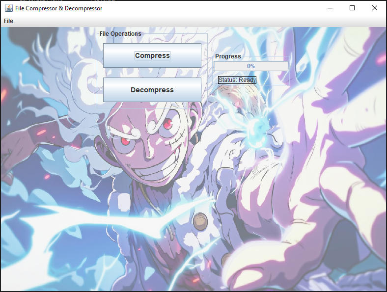

# Compressor_Decompressor

## Project Overview

**Compressor_Decompressor** is a Java-based application that allows users to compress and decompress files using the efficient GZip algorithm. With its sleek, intuitive graphical interface designed using Java Swing, the tool provides a seamless experience for managing file sizes without compromising data integrity. Whether you're looking to reduce file sizes for storage or quickly decompress archived files, this application delivers high performance with a simple, user-friendly design.

## Features at a Glance

### 🔄 File Compression
- **Simple File & Folder Selection**: Quickly choose files or entire directories for compression.
- **Customizable Output**: Easily specify where the compressed files should be saved.
- **Real-time Progress Tracking**: Stay informed with a progress bar and status updates while compression is in progress.
- **Instant Notifications**: Get notified when compression is complete.
- **Lossless Compression**: Ensure your files retain their original quality and data integrity.

### 🗂️ File Decompression
- **Easy Decompression**: Select GZip-compressed files and restore them to their original state with just a few clicks.
- **Custom Output Location**: Specify where the decompressed files should be stored.
- **Visual Feedback**: Keep track of the decompression progress with a dynamic progress bar.

### 🖥️ Enhanced User Interface (UI)
- **Responsive Design**: A clean, modern layout that adjusts smoothly to different file operations.
- **Interactive Buttons & File Dialogs**: Simple and intuitive buttons and dialogs for selecting files and folders.
- **Detailed Status Messages**: Users receive helpful status messages, ensuring they know exactly what's happening at every step.
- **Error Handling**: Graceful handling of issues like file not found, invalid formats, or disk space limitations with informative messages.

## Technical Details

### Tech Stack
- **Java**: The core programming language used to build the application's logic.
- **Java Swing**: GUI framework used to craft a responsive and visually appealing interface.
- **GZip Algorithm**: Industry-standard algorithm for lossless compression and decompression.

### Multi-threaded Performance
The application utilizes multi-threading to handle long-running compression and decompression tasks in the background, preventing the user interface from freezing during operations. This ensures a fluid user experience even with large files or directories.

## Download Links

- [Download JAR (requires Java installed)](https://github.com/vivek-384/Compressor_Decompressor/raw/main/CompressorDecompressor.jar)
- [Download EXE](https://github.com/vivek-384/Compressor_Decompressor/raw/main/Compressor_Decompressor.exe)

## Getting Started

### Or you can clone this repository:
1. Clone this repository:
   ```bash
   git clone https://github.com/vivek-384/Compressor_Decompressor.git

2. Navigate to the project directory
    ```bash
    cd Compressor_Decompressor

3. Compile the Java code
    ```bash
    java -jar CompressorDecompressor.jar

## Screenshot

### User Interface


## Conclusion

The **Compressor_Decompressor** application offers a reliable and user-friendly solution for file compression and decompression using the GZip algorithm. Whether you're managing large files or just looking to optimize storage, this tool simplifies the process while ensuring data integrity. 

Feel free to explore the code, contribute, or reach out if you have any questions or suggestions!

## License
This project is licensed under the MIT License - see the [LICENSE](LICENSE) file for details.

## Author
Developed by [@vivek-384](https://github.com/vivek-384). Feel free to reach out for suggestions, issues, or collaboration!
